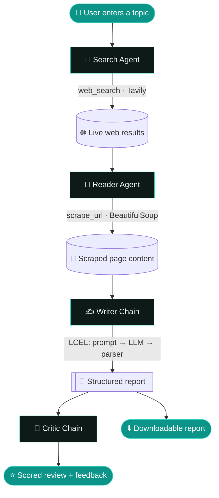

<div align="center">

# 🧭 ResearchPilot

### AI Research, on autopilot

Enter any topic and four specialised AI agents **search** the live web, **read** the
best source, **write** a structured report, and **critique** it — all from a polished
Streamlit interface.

[](https://research-tool-vik.streamlit.app)


</div>

---

## ✨ Features

- **Multi-agent pipeline** — Search → Read → Write → Critique
- **Live web research** via Tavily, deep reading via BeautifulSoup
- **Structured reports** with introduction, key findings, conclusion, and sources
- **Built-in critic** that scores each report and flags weak spots
- **Polished multi-page UI** (Home, Research, Dashboard, My Reports, About)
- **Downloadable** Markdown reports and a session report library

---

## 🔬 How it works

The system chains four agents together. The output of each step becomes the input of
the next, so a single topic flows all the way from a web search to a reviewed report.



### Step by step

| # | Agent | Tool / Chain | What it does |
|---|-------|--------------|--------------|
| 1 | **🔎 Search Agent** | `web_search` (Tavily) | Decides what to search and fetches recent, reliable sources. |
| 2 | **📖 Reader Agent** | `scrape_url` (BeautifulSoup) | Picks the most relevant URL and scrapes its full text for depth. |
| 3 | **✍️ Writer Chain** | LCEL (`prompt → LLM → parser`) | Turns the research into a structured report. |
| 4 | **🧐 Critic Chain** | LCEL (`prompt → LLM → parser`) | Scores the report out of 10 and lists strengths & fixes. |

---

## 🧱 Tech stack

`Python` · `Streamlit` · `LangChain (LCEL)` · `Groq (Llama 3.1)` · `Tavily` · `BeautifulSoup`

---

## 🚀 Getting started

### 1. Clone the repo

```bash
git clone https://github.com/VikashMaheshwari/Research-Tool.git
cd Research-Tool
```

### 2. Install dependencies

```bash
pip install -r requirements.txt
```

> Or, if you use [uv](https://github.com/astral-sh/uv): `uv sync`

### 3. Add your API keys

Copy the example file and fill in your own keys:

```bash
cp .env.example .env
```

Then edit `.env`:

```env
GROQ_API_KEY=your_key
TAVILY_API_KEY=your_key
OPENAI_API_KEY=your_key
```

> 🔑 Get free keys from [Groq Console](https://console.groq.com) and [Tavily](https://tavily.com).

### 4. Run it

**Web app (recommended):**

```bash
streamlit run app.py
```

Then open the URL it prints (usually `http://localhost:8501`).

**Command-line pipeline (original):**

```bash
python pipelines.py
```

---

## 📁 Project structure

```
Research-Tool/
├─ app.py                # Streamlit entry point — wires the pages together
├─ ui.py                 # Shared theme, colours, components & graphics
├─ agents.py             # The 4 agents + writer/critic LCEL chains
├─ tools.py              # web_search (Tavily) + scrape_url (BeautifulSoup)
├─ pipelines.py          # Original command-line pipeline
├─ views/                # Web pages
│  ├─ home.py            #   landing page
│  ├─ research.py        #   the research tool
│  ├─ dashboard.py       #   usage dashboard
│  ├─ history.py         #   saved reports
│  └─ about.py           #   about / FAQ
├─ .streamlit/config.toml
├─ .env.example          # template for your API keys
├─ requirements.txt
└─ README.md
```

---

## 🧭 App navigation

| Page | What you'll find |
|------|------------------|
| 🏠 **Home** | Product overview, features, how-it-works |
| 🔎 **Research** | Enter a topic and watch the agents work live |
| 📊 **Dashboard** | Usage stats and recent activity |
| 📚 **My Reports** | Browse and download past reports |
| ℹ️ **About** | How the agents work + FAQ |

---

## 🔒 Security

Your `.env` file is **git-ignored** — never commit real API keys. The repo only
includes `.env.example` with placeholders.

---

## 📄 License

Released under the [MIT License](LICENSE).
